Zuerst muss Git/Bash installiert werden. Dies ist notwerdig, da die Befehle eigentlich für Linux gemacht sind, und Windows gewisse Befehle nicht kennt. Dies kann von https://git-scm.com/install/ heruntergeladen werden. Bei der Installation kann alles auf Standart belassen werden 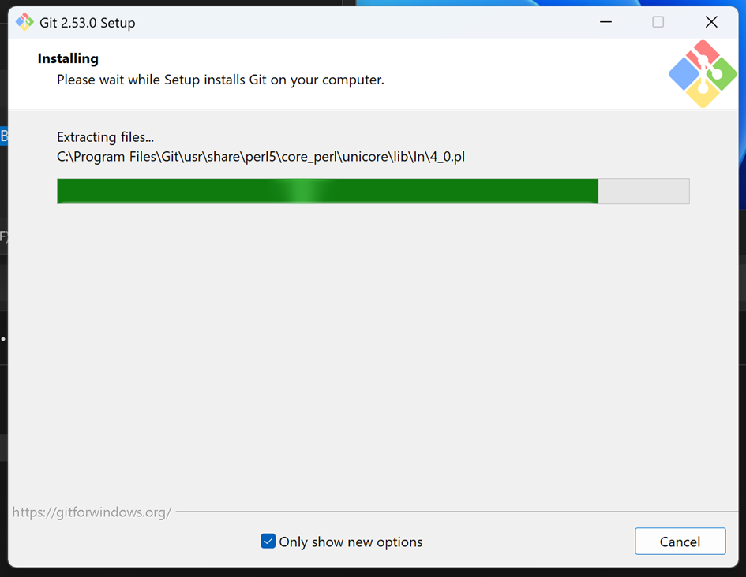

Wenn nachfolgend von Terminal/CMD gesprochen wird, ist Bash gemeint. 

Nun muss als erstes Git konfiguriert werden. Dazu werden der Githb Username und die Email adresse benötigt. 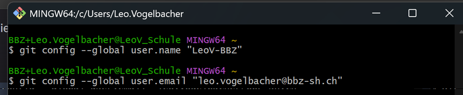

Anschliessen kann als Test das folgende Repository geklont werden. ( https://gitlab.com/ch-tbz-it/Stud/m300/M300) Der Command dazu lautet "git clone [https://xxxxx.com]"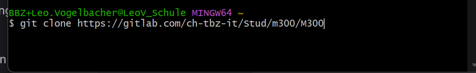


Anschliessend kann man mit den Commands, welche im Bild zu sehen sind weiter testen, ob alles funktioniert. 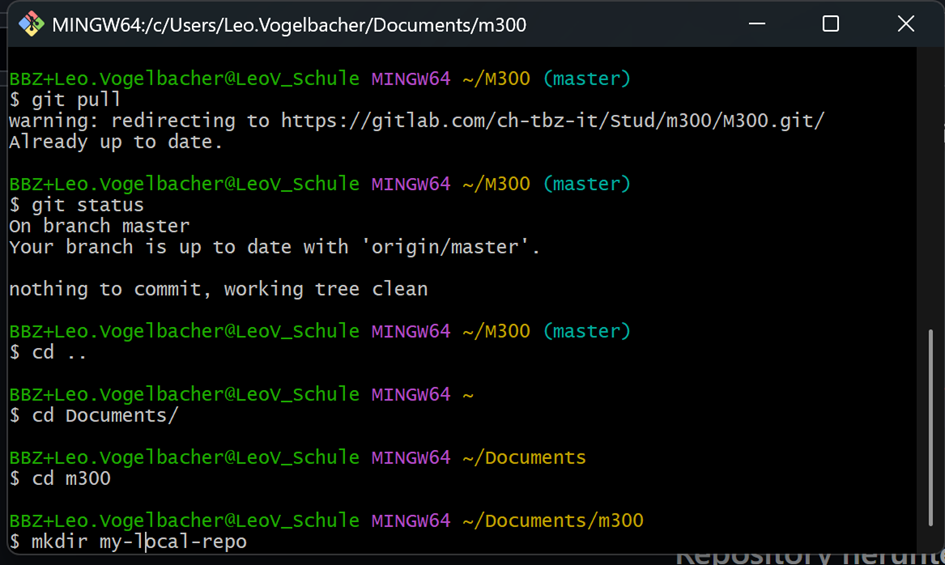

Damit man nun über Bash testen kann, ob auch der Upload korrekt funktioniert, erstellt man am besten im Ordner des Repos ein neues textdoument. Anschliessend kann mit den befehlen 
"  $ git add -A ."
"  $ git commit -m "Mein Kommentar""
"  $ git push"
die Änderungen zu Github hochladen. 
Anschliessen sollte der Inhat vom Lokalen Repo auch auf Github zu sehen sein. 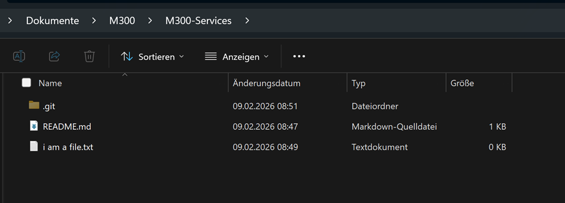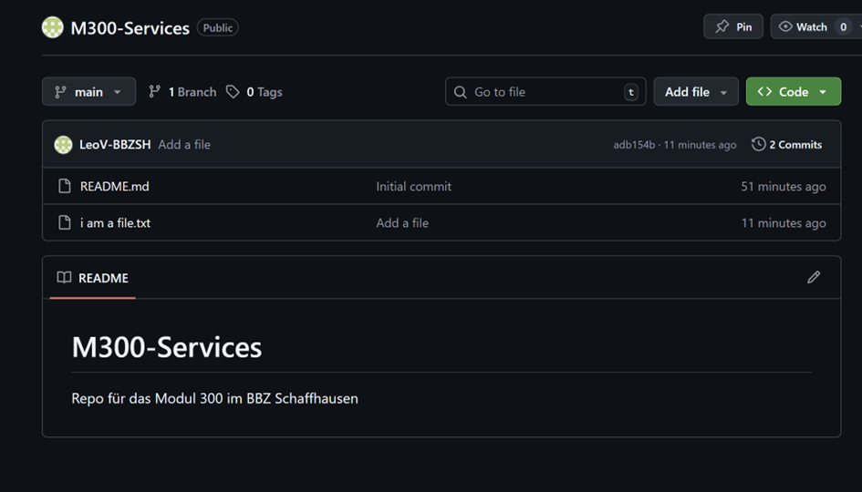

Folgende Befehle mit Git sollte man sich merken, da diese immer wieder benötigt werden. 
$  git status                      # Geänderte Datei(en) werden rot aufgelistet
$  git add -A                      # Fügt alle Dateien zum "Upload" hinzu
$  git status                      # Der Status ist nun grün > Dateien sind Upload-bereit (Optional) 
$  git commit -m "Mein Kommentar"  # Upload wird "commited" > Kommentar zu Dokumentationszwecken ist dafür notwendig
$  git status                      # Dateien werden nun als "zum Pushen bereit" angezeigt
$  git push                        #Upload bzw. Push wird durchgeführt

# VirtualBox
VirtualBox ist ein Tool zum erstellen und verwalten von Virtuellen Maschinen, ähnlich wie VMware Workstation. 
Zuerst muss VirtualBox von der offiziellen Webseite heruntergeladen werden. https://www.virtualbox.org/ 
Anschliessend folgt die Installation mit den Standartwerten. Ich werde deshalb nicht weiter darauf eingehen. 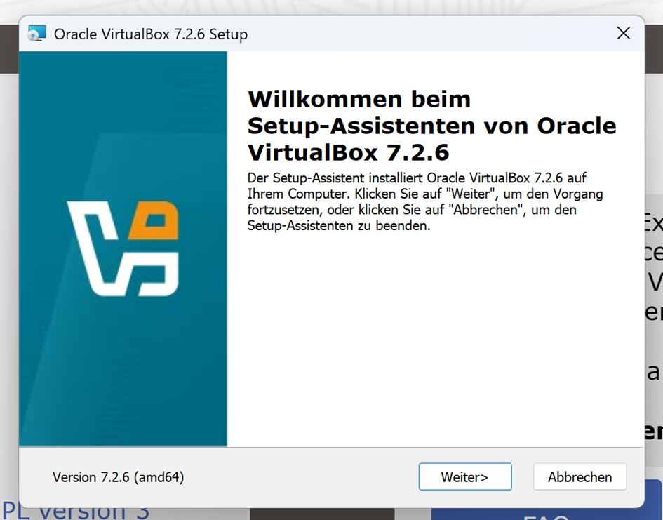

Anschliessend kann man über den Button "Neu" eine VM erstellen. Es empfiehlt sich den Haken bei "Unbeaufsichtigter Installation zu setzen, da das Aufsetzen somit nichtmehr ganz so lang geht. Zudem kann angegeben werden, wie die VM heissen soll,  wo sie gespeichert ist, und welche ISo verwendet werden soll.  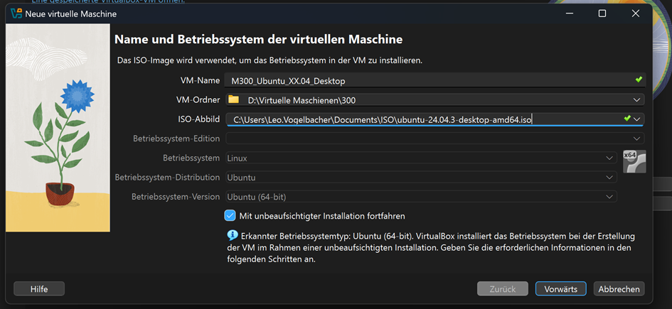
Nachdem man anschliessend auf Vorwärts geklickt hat, kommt ein neues Fenster, bei welchem man Benutzername und Passwort eingeben muss. Auch der Host und Domainnamen können hier eigegeben werden. (Kommt nicht wenn man keine Unbeaufsichtigte installation macht. )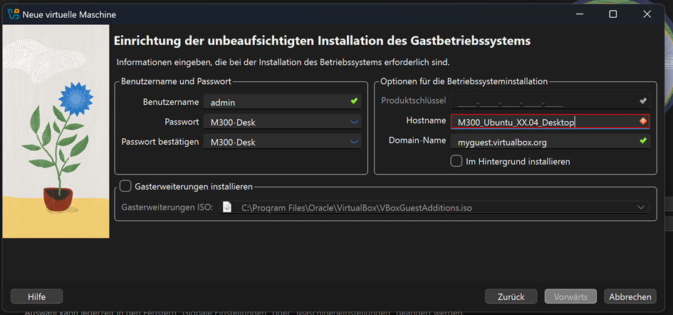

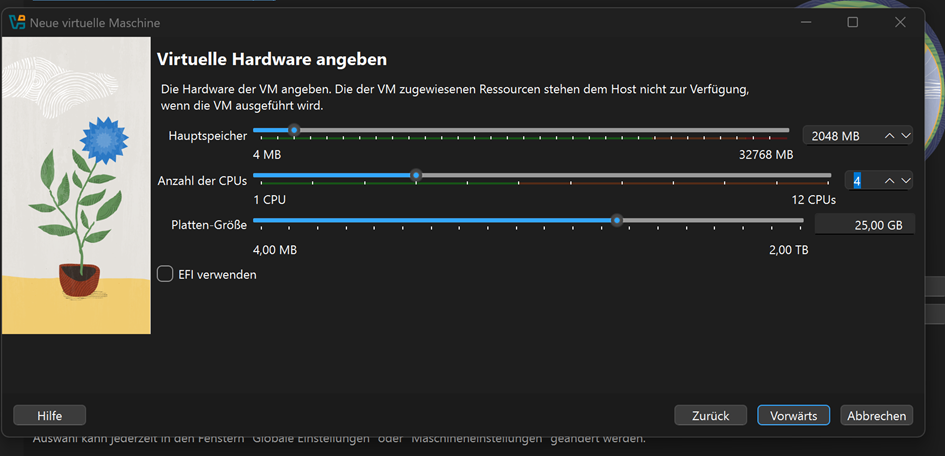

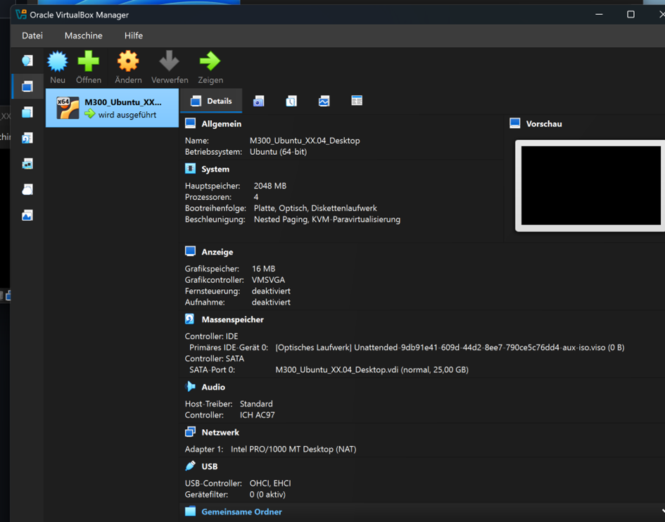


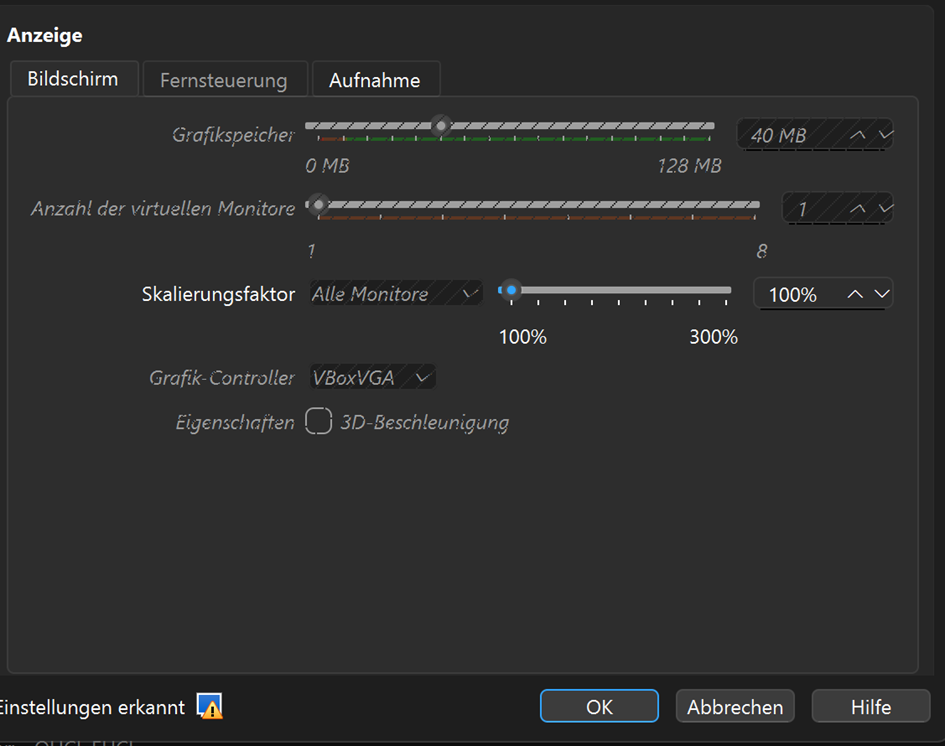


 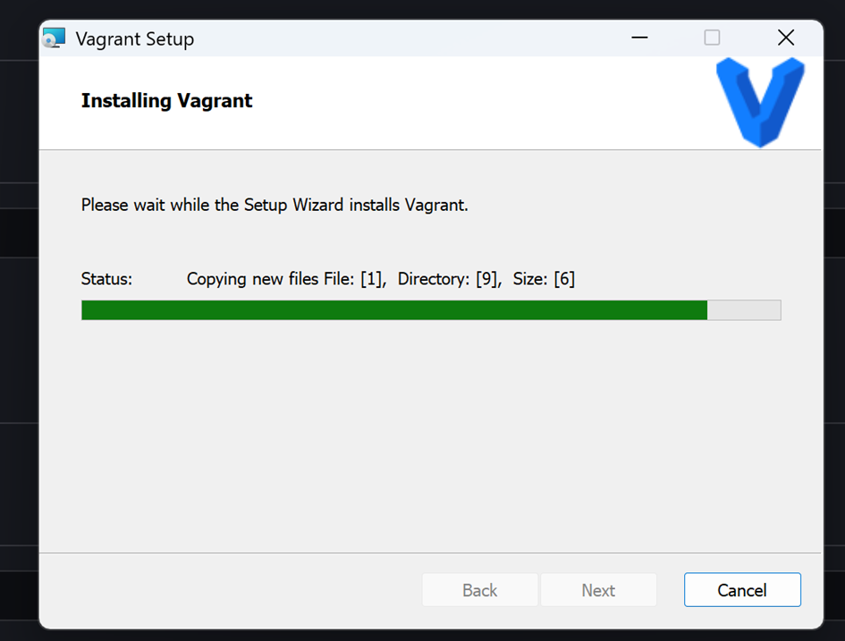
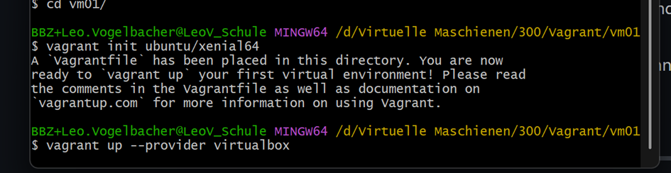

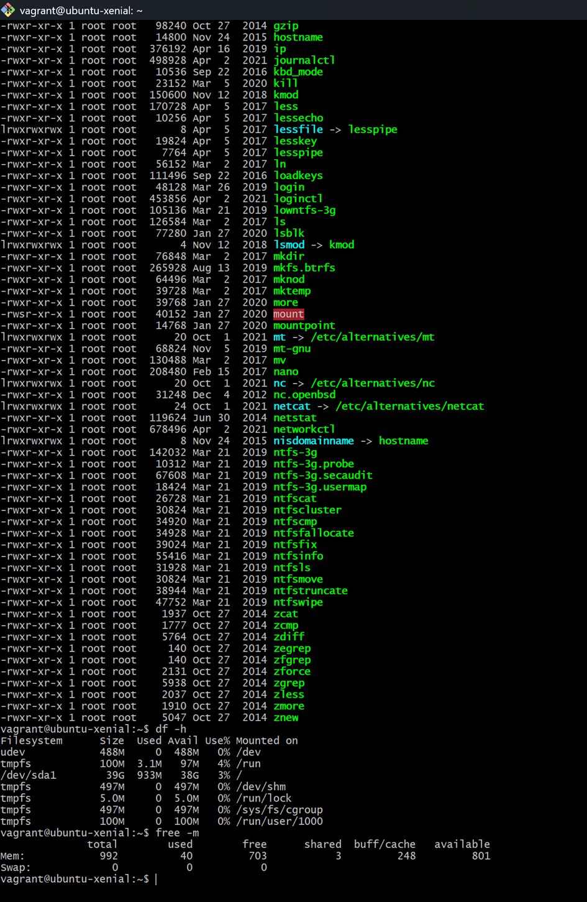

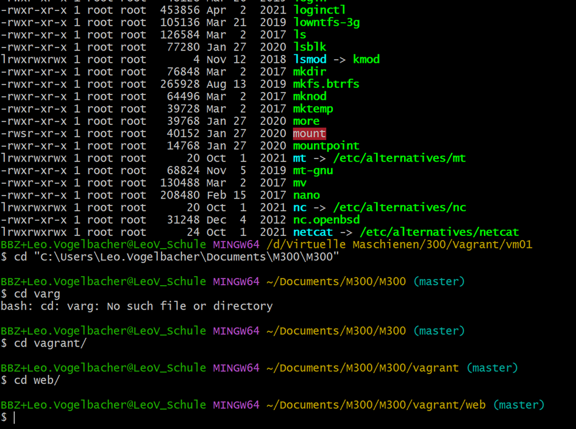

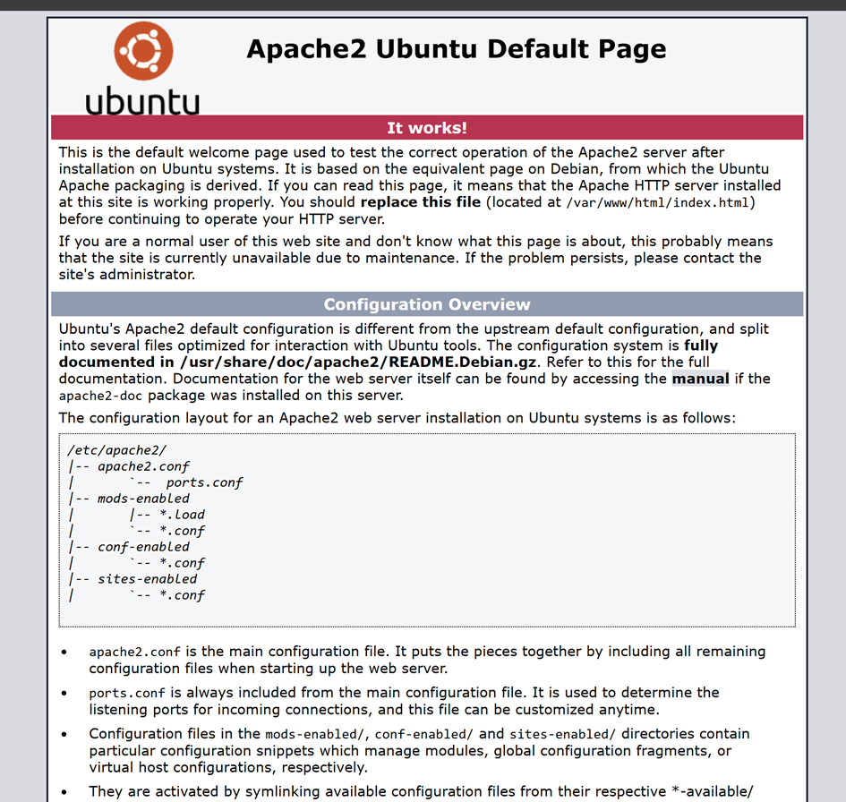

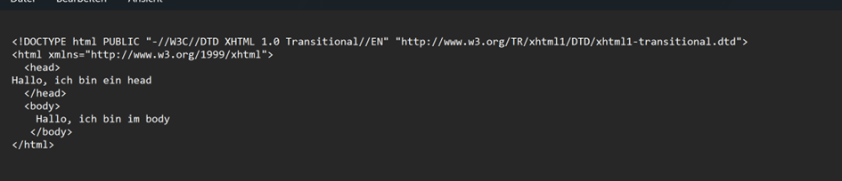

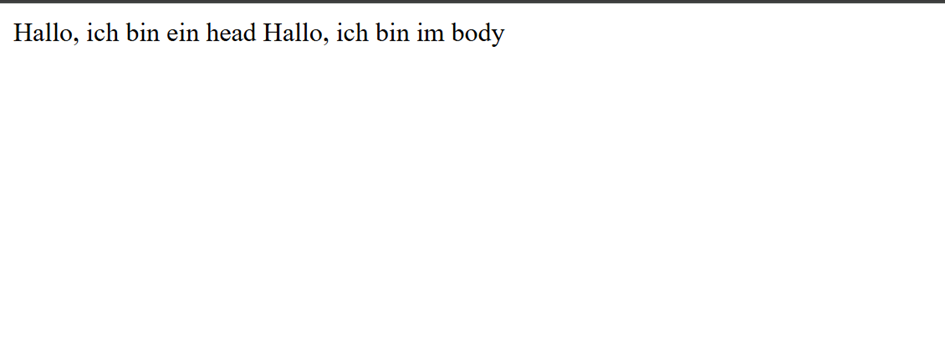


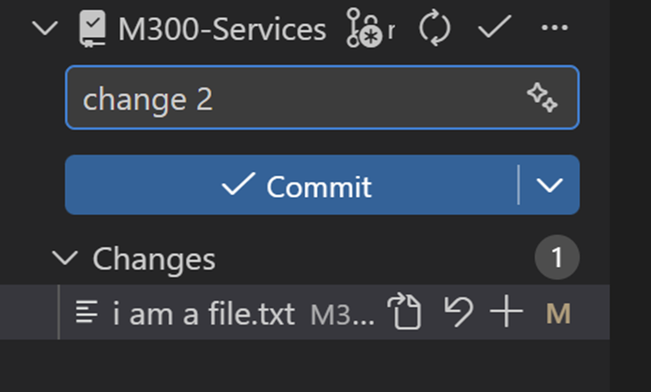


# Tag 2

Cloud Computing ist, wenn man Programme nicht auf dem Lokelen rechner ausführt, sondern auf einem Rechner oder Server in der Ferne. (zb. über das Internet.)

**Saas** = Infrastructure as a Service 


**PaaS** = Platform as a Service

**IaaS** = Infrastructure as a Service 

Zudem gibt es seit dem Aufkommen von Docker/ Container eine neue ebene. Diese heisst **CaaS** (Container as a service).
Diese Ebene ist dafür zuständig, containerisierten Workload auf den Ressourcen auszuführen, die eine IaaS-Cloud zur Verfügung stellt. Die Technologien dieser Ebene wie Docker, Kubernetes oder Mesos sind allesamt quelloffen verfügbar. Somit kann man sich seine private Cloud ohne Gefahr eines Vendor Lock-ins aufbauen.

# Microsoft Azure
Azure verwendet Virtualisierung, damit alle Produkte laufen können. Die Server auf denen die Virtuellen Maschienen laufen nennt man Hypervisor. Ein solcher Server ist meist sehr stark, und ist die Heimat von Mehreren Virtuellen Maschinen. Die Virtuellen Maschienen sind dabei Unabhängig von den anderen, und können Alle möglichen Betriebssysteme haben. 

Die Server sind in soganannten Racks zusammengefasst. Wenn jemand eine VM erstellt, wird die Anfrage zuerst über die API an den sogenannten "Orchestrator" geleitet. Dieser sammelt alle Informationen und sucht sich dann das beste Rack aus, und leitet die Informationen dorthin weiter. 

Weitere Anbieter für Cloudcomputig sind AWS, Google Cloud, Oracle, ...


# Infrastructure as  Code
Früher war IT an physische Hardware gebunden und wurde manuell betrieben – Änderungen waren langsam und teuer.  
Heute sind Systeme virtualisiert und automatisiert, Änderungen sind schnell umsetzbar.

**Infrastructure as Code** bedeutet, IT-Infrastruktur wie Software zu behandeln: Sie wird in Dateien definiert, versioniert, getestet und automatisch bereitgestellt.

**Ziele von IaC** sind schnelle Änderungen, weniger manuelle Arbeit, stabile und reproduzierbare Systeme sowie kontinuierliche Verbesserungen statt grosser Umbauprojekte.

# Vagrant

Wichtige Commands:


| Befehl          | Beschreibung                                                                                                      |
| --------------- | ----------------------------------------------------------------------------------------------------------------- |
| vagrant init    | Initialisiert im aktuellen Verzeichnis eine Vagrant-Umgebung und erstellt, falls nicht vorhanden, ein Vagrantfile |
| vagrant up      | Erzeugt und Konfiguriert eine neue Virtuelle Maschine, basierend auf dem Vagrantfile                              |
| vagrant ssh     | Baut eine SSH-Verbindung zur gewünschten VM auf                                                                   |
| vagrant status  | Zeigt den aktuellen Status der VM an                                                                              |
| vagrant port    | Zeigt die Weitergeleiteten Ports der VM an                                                                        |
| vagrant halt    | Stoppt die laufende Virtuelle Maschine                                                                            |
| vagrant destroy | Stoppt die Virtuelle Maschine und zerstört sie.                                                                   |
|                 |                                                                                                                   |
|                 |                                                                                                                   |
Diverses: Mit vagrant ssh kann man sich in die VM verbinden. Dort kann man dan wie auf einer normalen VM arbeiten. 

Achtung, die dinge die man in der VM macht, werden nach dem neu starten nicht übernommen. Dazu müsste man die Commands im Vagrant file hinzufügen. Allternativ kann man sich auch eine externe Provisionierungsdatei bauen. 

**Vagrant Boxen**  
Boxen sind vorkonfigurierte VM-Vorlagen, die die Softwareverteilung und Entwicklung beschleunigen. Einmal heruntergeladen, werden sie lokal gespeichert. Boxen lassen sich mit `vagrant box add` hinzufügen und mit `vagrant box remove` löschen. Sie folgen meist dem Schema _Entwickler/Box_ (z. B. `ubuntu/xenial64`) und werden über die Vagrant-Boxen-Plattform bereitgestellt und geteilt.

**Konfiguration**  
Die gesamte VM-Konfiguration erfolgt im **Vagrantfile** (Ruby-ähnliche Syntax). Dort werden Box, Netzwerk, Hostname und Provisioning definiert.
Beispiel:

```
    Vagrant.configure("2") do |config|
        config.vm.define :apache do |web|
            web.vm.box = "bento/ubuntu-16.04"
            web.vm.provision :shell, path: "config_web.sh"
            web.vm.hostname = "srv-web"
            web.vm.network :forwarded_port, guest: 80, host: 4567
            web.vm.network "public_network", bridge: "en0: WLAN (AirPort)"
    end
```

**Provisioning**  
Provisioning führt automatisch Befehle aus (meist Shell/Bash), z. B. um Software wie Apache zu installieren.
Beispiel:
```
    config.vm.provision :shell, inline: <<-SHELL 
        sudo apt-get update
        sudo apt-get -y install apache2
     SHELL
```

**Provider**  
Der Provider legt fest, welche Virtualisierungsplattform genutzt wird (z. B. VirtualBox) und erlaubt Einstellungen wie Arbeitsspeicher.

Beispiel:
```
config.vm.provider "virtualbox" do |vb|
        vb.memory = "512"  
    end
```


### **Reihenfolge für den Betrieb, das Updaten und das Zerstören einer VM.** 
**Box hinzufügen**  
Eine neue Box wird zur lokalen Registry hinzugefügt mit:

```
`vagrant box add [box-name]`
```

Alle lokal verfügbaren Boxen lassen sich anzeigen mit:

```
`vagrant box list`
```

**VM erstellen**  
Zum Erstellen einer virtuellen Maschine wird ein Vagrantfile angelegt und die Provisionierung gestartet:

```
`mkdir myserver cd myserver vagrant init ubuntu/xenial64 vagrant up`
```

Der aktuelle Status der VM kann jederzeit abgefragt werden mit:

```
`vagrant status`
```

**VM aktualisieren**  
Nach Anpassungen am Vagrantfile kann die VM neu provisioniert werden:

```
vagrant provision
```

Alternativ kann die VM komplett neu erstellt werden:

```
`vagrant destroy -f vagrant up`
```

**VM löschen**  
Zum vollständigen Entfernen der virtuellen Maschine dient folgender Befehl:

```
vagrant destroy -f
```


### Synchronisierte Ordner
Mithilfe von synchronisierten Ordnern kann die VM auf ein Verzeichnis auf dem Host System zugreiffen. Dies ist vorallem bei Webservern, docker, usw. sinvoll. 

```
    Vagrant.configure(2) do |config|
        config.vm.synced_folder ".", "/var/www/html"  
    end
```
**Wichtig:** Standardmässig wird das aktuelle Vagrantfile-Verzeichnis in der VM unter /vagrant gemountet.

# Packer
Packer ist ein Tool zur Erstellung von Images bzw. Boxen für eine Vielzahl von Dynamic Infrastructure Platforms mittels einer Konfigurationsdatei.
Packer wird ähnlich wie Vagrant über die CLI bedient.
Der wichtigste Befehl ist:
```
packer build
```
Dieser wird benötigt, um aus der Konfiguration, welche im JSON Format erfolgt (Beispiel siehe unten) ein Image zu erstellen. 
Beispiel: 
```
    {
      "provisioners": [
        {
          "type": "shell",
          "execute_command": "echo 'vagrant'|sudo -S sh '{{.Path}}'",
          "override": {
            "virtualbox-iso": {
              "scripts": [
                "scripts/server/base.sh",
              ]
            }
          }
        }
      ],
      "builders": [
        {
          "type": "virtualbox-iso",
      "boot_command": [
        " preseed/url=http://{{ .HTTPIP }}:{{ .HTTPPort }}/ubuntu-preseed.cfg<wait>",
      ],
        }
      ],
      "post-processors": [
        {
          "type": "vagrant",
          "override": {
            "virtualbox": {
              "output": "ubuntu-server-amd64-virtualbox.box"
            }
          }
        }
      ]      
    }
```

**Provisioning**  
Auch bei Packer steht Provisioning für Anweisungen an ein anderes Programm (z.B. eine Shell wie Bash).

**Builder**  
Die Builder erstellen ein Image für eine bestimmte dynamische Infrastruktur-Plattform (wie z.B. VirtualBox).

**Post-processors**  
Sind Bestandteile von Packer, die das Ergebnis eines Builders oder eines anderen Post-Prozessor übernehmen, um damit ein neues Artefakt zu erstellen.


# LB2

Zuerst erstellt man eine VM. Dies wurde Bereits Beschrieben, daher ist hier nur ein Foto zu sehen. 

Anschliessend die VM starten. (Dies kann ein paar Minuten dauern)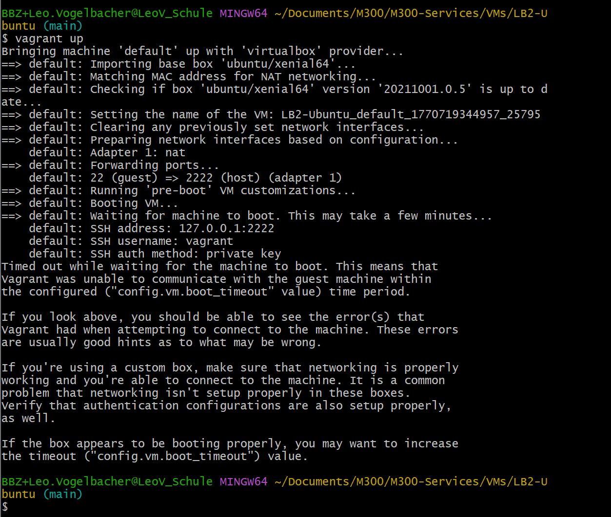


Anschliessend verbindet man sich mit vagrant ssh mit der VM. 

Achtung: Teilweise muss man 2-3 Minuten warten, bis die VM wirklich korrekt gestartet ist. 

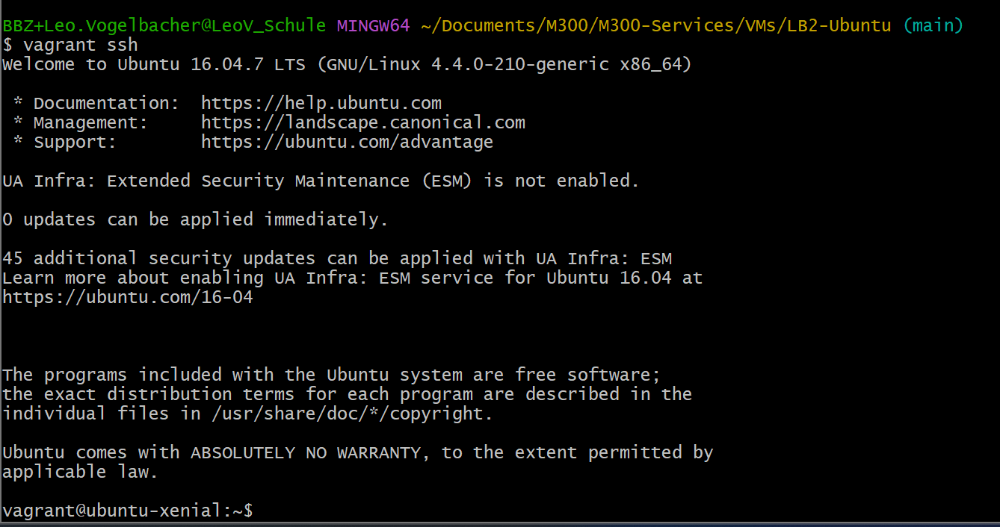


Nun sollten als erstes die Packetquellen Aktualisiert werden. 
```
sudo apt-get update
```
(eventuelle Fragen mit "Y" bestätigen )

Danach können apache und Webanalyser installiert werden. dazu die folgenden Commands ausführen. 
```
sudo apt-get install -y apache2
```

```
sudo apt-get install -y webalizer 
```

Damit man diese Commands nun nicht immer ausführen muss, kann man sich mit "history" die gemachten befehle anzeigen lassen. Die relevanten befehle können nun in das Vagrant file kopiert werden. 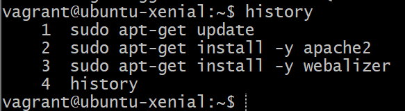

(Vagrantfile mit "nano Vagrantfile" öffnen und die Befehle unter "config.vm.provision.shell" einfügen)
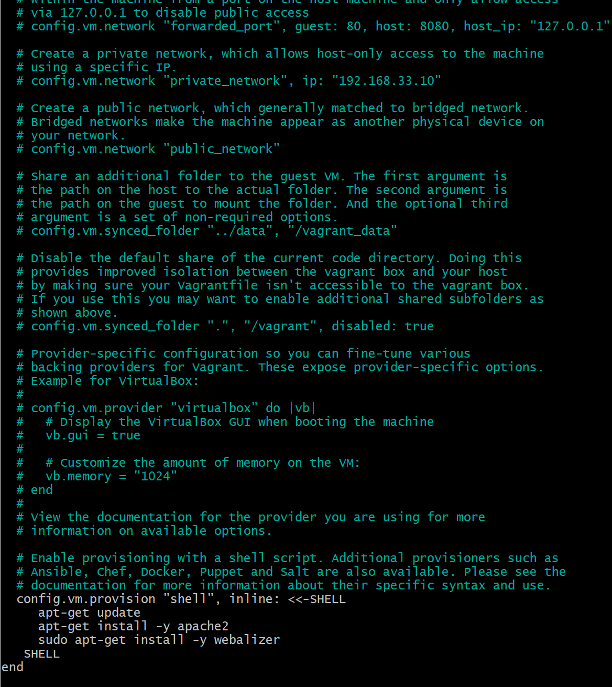


Wenn man die VM nun zerstört und anschliessend wieder startet, werden die 3 Commands automatisch ausgeführt. Dies lässt sich auch auf der Shell anzeigen.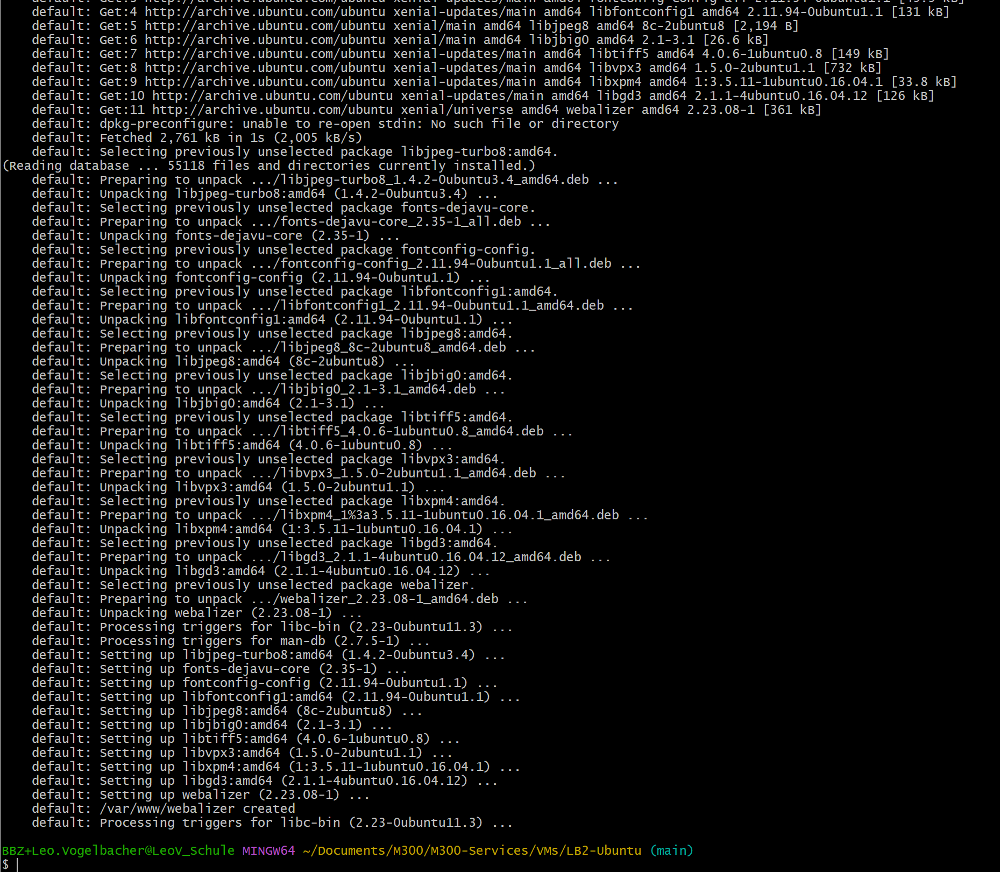

Die Verbindung mit dem Webserver wird allerdings mit diesen anpassungen noch nicht möglich sein, da noch weitere probleme bestehen.
- Dateien sind nach dem Zerstören der VM nicht mehr vorhanden
- Port vom Webserver, in der VM, wird nicht weitergeleitet an Host.
- Es existiert keine index.html unter `/var/www/webalizer/index.html`. Siehe **Hinweis** bei [Verwendung](https://wiki.ubuntuusers.de/Webalizer/#Verwendung)
- Der URL (z.B. via `curl http://localhost/webalizer`) von Webanalyzer kann nicht abgerufen werden

Die Probleme lassen sich folgendermaasen lösen:

1. Erstellen eines Synchronisierten Ordners. Die Dateien werden damit vom Host auf die VM Synchronisiert. 
   
```
config.vm.synced_folder ".", "/var/www/html"
```


2. Der Port 80 auf der VM muss für den Host freigegeben werden. Im hier gezeigten Beispiel wird Port 80 auf der VM als Port 8080 auf dem Host freigegeben. 
   
```
config.vm.network "forwarded_port", guest:80, host:8080, auto_correct: true
```


3. Für die restlichen beiden Probleme sind einige befehle mehr nötig, da der Webserver ja nicht Produktiv genutzt wird.

Traffic erzeugen, damit es etwas zum Analysieren gibt	   
```
curl http://localhost/ >/dev/null 2>&1
curl http://localhost/ >/dev/null 2>&1
curl http://localhost/ >/dev/null 2>&1
curl http://localhost/ >/dev/null 2>&1
curl http://localhost/bad >/dev/null 2>&1    
```

Da der Webanalyser immer nur die Vorletzten Logdatan analysiert, müssen die Acces Logs rotiert werden. 

```
sudo logrotate -f /etc/logrotate.d/apache2    
```

Zudem muss das Outputverzeichniss korrigiert werden. 

```
sudo sed -i -e"s:/var/www/webalizer:/var/www/html/webalizer:" /etc/webalizer/webalizer.conf 
```

Zum Schluss muss der Job für die Erzeugung der Ausgaben noch manuell ausgeführt werden. 

```
sudo /etc/cron.daily/webalizer 
```


Das Vagrant File sollte fertig zusammengebaut so aussehen:


```
Vagrant.configure(2) do |config|
  config.vm.box = "ubuntu/xenial64"
  config.vm.network "forwarded_port", guest:80, host:8080, auto_correct: true
  config.vm.synced_folder ".", "/var/www/html"  
config.vm.provider "virtualbox" do |vb|
  vb.memory = "512"  
end
config.vm.provision "shell", inline: <<-SHELL
  # Packages vom lokalen Server holen
  # sudo sed -i -e"1i deb {{config.server}}/apt-mirror/mirror/archive.ubuntu.com/ubuntu xenial main restricted" /etc/apt/sources.list 
  # Debug ON!!!
  set -o xtrace  
  sudo apt-get update
  sudo apt-get -y install apache2 webalizer 
  sudo /etc/cron.daily/webalizer
  # Testdaten erzeugen
  curl http://localhost/ >/dev/null 2>&1
  curl http://localhost/ >/dev/null 2>&1
  curl http://localhost/ >/dev/null 2>&1
  curl http://localhost/ >/dev/null 2>&1
  curl http://localhost/bad >/dev/null 2>&1
  # Patch falsches Output Verzeichnis von webalizer 
  sudo sed -i -e"s:/var/www/webalizer:/var/www/html/webalizer:" /etc/webalizer/webalizer.conf 
  sudo mkdir -p /var/www/html/webalizer 
  # Logfiles von Apache rotieren und neue Analyse
  sudo logrotate -f /etc/logrotate.d/apache2
  sudo /etc/cron.daily/webalizer  
SHELL
end
```


#  25 Infrastruktur-Sicherheit

Aktuell sind alle Services frei zugreifbar, was ein Sicherheitsrisiko darstellt, wenn eine VM direkt im Internet oder in einer DMZ betrieben wird. Zur Absicherung werden nicht-öffentliche Ports mit einer Firewall gesperrt und der verbleibende Datenverkehr über einen Reverse Proxy verschlüsselt.

Eine **Firewall** kontrolliert und beschränkt den Netzwerkverkehr anhand definierter Regeln wie Absender, Ziel und Dienst, um unerwünschte Zugriffe zu verhindern.

Ein **Reverse Proxy** steht zwischen Client und Server, leitet Anfragen weiter und verbirgt dabei die interne Serveradresse, wodurch zusätzliche Sicherheit entsteht.


# 30 Container
Container ermöglichen es, Software überall identisch auszuführen – lokal, im Rechenzentrum oder in der Cloud. Entwickler erhalten reproduzierbare Umgebungen, Administratoren sparen Zeit bei Konfiguration und Abhängigkeiten.

**Merkmale:**

- Teilen Ressourcen mit dem Host
    
- Sehr schnell startbar
    
- Portierbar und leichtgewichtig
    
- Ideal für die Cloud

**Geschichte**
- Ursprünge in UNIX mit `chroot` (Dateisystem-Isolation)
    
- 1998: FreeBSD Jails erweitern Isolation auf Prozesse
    
- 2001: Solaris Zones (umfassend, aber Solaris-gebunden)
    
- 2001/2005: Virtuozzo → OpenVZ (Linux-Container-Technologie)
    
- Google entwickelt CGroups für Linux
    
- 2008: LXC kombiniert CGroups, Namespaces und chroot
    
- 2013: Docker macht Container massentauglich und bringt den Durchbruch in den Mainstream

**Was sind Microservices?**
Microservices sind ein grosser Hype. Am besten beschreiben lassen sie sich als allternativer Architekturstil zu den tradizionellen Applikationen. Es können sehr einfach viele, unabhängige Prozesse erstellt werden. Je nach konfiguration, können die Services miteinander kommunizren, oder eben nicht. Die Services können auch alle in einer anderen Programiersprache Geschrieben sein. Zudem haben die Services eine Dezentrale Führung. 
Microservices sind aber keine SOA, oder ein Allheilmittesl. Auch sie haben nachteile. 

**Vorteile**
- Einfach einen einzelnet Dienst zu verstehen
- Einzelne Dienste können einfach getestet, deployed oder gemanaged werden. 
- Keine Abhängigkeit von bestimmten Sprachen. 
- Skalierung ist effizienter als bei einer Monolith Architektur

**Herausforderungen**
- Einzelne Services können ausfallen
- Remote aufrufe sind teurer
- Features können sich über mehrere Dienste erstrecken. 
- Änderungsmanagement ist komplexer
- Komplexität wird zum operativen Betrieb verschoben. 

Es ist wichtig, das die Dokumentation kurz genug ist, damit sie verstanden werden kann. Zudem muss das verhalten vorhersagbar sein. 

# Docker

Es läuft auf allen Systemen gleich. Wenn es auf einem Laptop läuft, läuft es auch auf dem Server.  Docker sind zudem effizienter im Ressourcenbrauch, als virtuelle Maschinen. 

- **Image:** Ein statischer Schnappschuss (Template), der das Betriebssystem, die Software und den Code enthält. Sie können nicht verändert, sondern nur neu gebaut werden. 
    
- **Container:** Eine laufende Instanz eines Images 
    
- **Dockerfile:** Eine Textdatei mit Anweisungen, wie ein Image Schritt für Schritt aufgebaut werden soll


##### Befehle im Dockerfile
**FROM**= Wählt das Basis-Image aus (standardmässig von https://hub.docker.com )
**WORKDIR**= Setzt das Arbeitsverzeichnis für alle folgenden RUN-, CMD-, ENTRYPOINT-, ADD oder COPY-Anweisungen.
**COPY**= - Wird verwendet, um Dateien aus dem Build Context in das Image zu kopieren. Es gibt die zwei Formen COPY src dest und COPY ["src", "dest"]. Das JSON-Array-Format ist notwendig, wenn die Pfade Leerzeichen enthalten.
**Run**= wird ausgeführt wenn conteiner gebaut wird
**CMD**= wird ausgeführt wenn container startet (Wenn auch ENTRYPOINT konfiguriert ist, wird die anweisung als argument für ENTRYPOINT verwendet)
**EXPOSE**=Gibt an, auf welchem Port der Container hören soll (z. B. Port 80 für Webserver)
**ADD**= Kopiert Dateien aus dem Build Context oder von URLs in das Image.
**ENTRYPOINT**=Legt eine ausführbare Datei (und Standardargumente) fest, die beim Start des Containers laufen soll.
- Jegliche CMD-Anweisungen oder an `docker run` nach dem Imagenamen übergebenen Argumente werden als Parameter an das Executable durchgereicht.
- ENTRYPOINT-Anweisungen werden häufig genutzt, um "Start-Scripts" anzustossen, die Variablen und Services initialisieren, bevor andere übergebene Argumente ausgewertet werden.
**ENV**=Setzt Umgebungsvariablen im Image.
**SHELL**= Die Anweisung SHELL erlaubt es seit Docker 1.12, die Shell für den folgenden RUN-Befehl zu setzten. So ist es möglich, dass nun auch direkt bash, zsh oder Powershell-Befehle in einem Dockerfile genutzt werden können.
**USER**= Setzt den Benutzer (über Name oder UID), der in folgenden RUN-, CMD- oder ENTRYPOINT-Anweisungen genutzt werden soll.
**VOLUME**=Deklariert die angegebene Datei oder das Verzeichnis als Volume. Besteht die Datei oder das Verzeichnis schon im Image, wird sie bzw. es in das Volume kopiert, wenn der Container gestartet wird.


Aus dem Dockerfile kann mit `docker build -t hello-world .`  das fertige Image erstellt werden. 
Anschliessend kann der docker mit `docker run` gestartet werden. Zum Portforwarding wird `-p 80:80` genutzt. (dabei ist die Linke seite der Port am laptop und rechts jener im Container 
Die Funktionsfähigkeit kann mit   `docker exec -it [containername] bash` geprüft werden. (Dieser Command verindet die lokale Shell mit dieser der VM, man kann so also Command im Container ausführen.)

Da Änderungen am Code im laufenden Container standardmäßig nicht sofort sichtbar sind, nutzt man Volumes

- Mit dem Flag `-v` wird ein lokaler Ordner direkt in den Container "gemountet". Änderungen am Code auf dem PC sind so sofort im Container wirksam, ohne dass ein Rebuild nötig ist

Best Practice: Immer nur 1 Hautaufgabe pro Container. 

**Docker Deamon**  

- Erstellen, Ausführen und Überwachen der Container
- Bauen und Speichern von Images

Der Docker Daemon wird normalerweise durch das Host-Betriebssystem gestartet.

**Docker Client**  

- Docker wird über die Kommandozeile (CLI) mittels des Docker Clients bedient
- Kommuniziert per HTTP REST mit dem Docker Daemon

**Docker Registry**  

- In Docker Registries werden Images abgelegt und verteilt

Die Standard-Registry ist der Docker Hub, auf dem tausende öffentlich verfügbarer Images zur Verfügung stehen, aber auch "offizielle" Images.

Viele Organisationen und Firmen nutzen eigene Registries, um kommerzielle oder "private" Images zu hosten, aber auch um den Overhead zu vermeiden, der mit dem Herunterladen von Images über das Internet einhergeht.

## Befehle

Um einen Docker zu starten, wird der folgende command verwendet. 
```
docker run
```

Nachde man docker irgendwo installiert hat, sollte man die installation mit dem folgenden Command testen. Es darf dabei keine Fehlermeldung kommen. 

```
docker run hello-world
```

Um einen Container mit interaktiver Shel zu verwenden, nutz man den folgenden Befehl:
```
docker run -it ubuntu /bin/bash
```

Der folgende Command lässt denn Container im Hintergrund laufen, und schaltet ihn nach 20 Sekunden aus. 
```
docker run -d ubuntu sleep 20
```

Startet einen Container im Hintergrund und löscht (remove) diesen nach Beendigung des Jobs:

```shell
    $ docker run -d --rm ubuntu sleep 20
```

Startet einen Container im Hintergrund und legt eine Datei an:

```shell
    $ docker run -d ubuntu touch /tmp/lock
```

Startet einen Container im Hintergrund und gibt das ROOT-Verzeichnis (/) nach STDOUT aus:

```shell
    $ docker run -d ubuntu ls -l
```

**docker ps**  

- Gibt einen Überblick über die aktuellen Container, wie z.B. Namen, IDs und Status.

Aktive Container anzeigen:

```shell
    $ docker ps
```

Aktive und beendete Container anzeigen (all):

```shell
    $ docker ps -a
```

Nur IDs ausgeben (all, quit):

```shell
    $ docker ps -a -q
```

**docker images**  

- Gibt eine Liste lokaler Images aus, wobei Informationen zu Repository-Namen, Tag-Namen und Grösse enthalten sind.

Lokale Images ausgeben:

```shell
    $ docker images
```

Alternativ auch mit `... image ls`:

```shell
    $ docker image ls
```

**docker rm und docker rmi**  

- `docker rm`
    - Entfernt einen oder mehrere Container. Gibt die Namen oder IDs erfolgreich gelöschter Container zurück.
- `docker rmi`
    - Löscht das oder die angegebenen Images. Diese werden durch ihre ID oder Repository- und Tag-Namen spezifiziert.

Docker Container löschen:

```shell
    $ docker rm [name]
```

Alle beendeten Container löschen:

```shell
    $ docker rm `docker ps -a -q`
```

Alle Container, auch aktive, löschen:

```shell
    $ docker rm -f `docker ps -a -q`
```

Docker Image löschen:

```shell
    $ docker rmi ubuntu
```

Zwischenimages löschen (haben keinen Namen):

```shell
    $ docker rmi `docker images -q -f dangling=true`
```

**docker start**  

- Startet einen (oder mehrere) gestoppte Container.
    - Kann genutzt werden, um einen Container neu zu starten, der beendet wurde, oder um einen Container zu starten, der mit `docker create` erzeugt, aber nie gestartet wurde.

Docker Container neu starten, die Daten bleiben erhalten:

```shell
    $ docker start [id]
```

Container Stoppen (Dten bleiben erhalten) 
``` shell
docker stop
```

Um den Container sofert zu stoppen kann folgendes verwendet werden.
```shell
docker kill
```

Zudem gibt es noch:
- `docker logs`
    - Gibt die "Logs" für einen Container aus. Dabei handelt es sich einfach um alles, was innerhalb des Containers nach STDERR oder STDOUT geschrieben wurde.
- `docker inspect`
    - Gibt umfangreiche Informationen zu Containern oder Images aus. Dazu gehören die meisten Konfigurationsoptionen und Netzwerkeinstellungen sowie Volumes-Mappings.
- `docker diff`
    - Gibt die Änderungen am Dateisystem des Containers verglichen mit dem Image aus, aus dem er gestartet wurde.
- `docker top`
    - Gibt Informationen zu den laufenden Prozessen in einem angegebenen Container aus.


### 05 - Image-Bereitstellung
Eigene Docker-Images können für Kollegen, CI-Server oder Endanwender bereitgestellt werden. Sie lassen sich über ein Dockerfile neu bauen, mit `docker pull` aus einer Registry laden oder mit `docker load` aus einer Archivdatei importieren.

Images bestehen aus einem Namen und einem Tag (z.B. `ubuntu:16.04`). Wird kein Tag angegeben, verwendet Docker automatisch `:latest`. Beim Erstellen oder mit `docker tag` können Namen und Tags vergeben werden. Tags dürfen nur Buchstaben, Zahlen, `.` und `-` enthalten, maximal 128 Zeichen lang sein und nicht mit `.` oder `-` beginnen.

Ein klares und konsistentes Namensschema ist wichtig für einen sauberen Entwicklungs-Workflow, da Docker selbst nur wenige Regeln vorgibt.

Der `latest`-Tag ist lediglich ein Standardwert ohne besondere technische Bedeutung. Wird kein Tag angegeben, nutzt Docker automatisch das mit `latest` markierte Image – existiert dieses nicht, tritt ein Fehler auf.

#### Docker Hub
Die einfachste Möglichkeit, eigene Docker-Images bereitzustellen, ist der Docker Hub, die offizielle Online-Registry von Docker Inc. Dort können öffentliche Repositories kostenlos genutzt werden, für private Repositories ist eine kostenpflichtige Variante verfügbar.

Um ein eigenes Image hochzuladen, erstellt man zuerst einen Account auf Docker Hub. Danach wird das Image mit dem eigenen Benutzernamen getaggt (z.B. `docker tag mysql username/mysql`) und anschliessend mit `docker push username/mysql` hochgeladen. Im Dashboard kann das Image danach beschrieben und verwaltet werden.

Mit `docker search` lassen sich Images auf Docker Hub suchen, und mit `docker pull` können Images heruntergeladen werden, zum Beispiel um Build-Zeiten zu verkürzen.

#### Import/Export von Images und Containern
Um Container und Images einfach nur zwischen verschiedenen Hosts hin und her zu verschieben, wird keine Registry benötigt.

Container können mittels `docker export` und `docker import` und Images mittels `docker save` und `docker load` von/nach Verzeichnisse kopiert werden.

**Container**  

Container exportieren:

```shell
    $ docker ps

        CONTAINER ID        IMAGE               COMMAND                  CREATED             STATUS              PORTS                  NAMES
        7fd371d71357        vagrant_apache      "/bin/sh -c '/bin/..."   3 hours ago         Up 3 hours          0.0.0.0:8080->80/tcp   vagrant_apache_1

    $ docker export vagrant_apache_1 -o va1.tar

    $ ls -lh

        total 200M
        -rwxrwxrwx 1 ubuntu ubuntu  731 Feb  2 08:28 Dockerfile
        -rwxrwxrwx 1 ubuntu ubuntu 200M Feb  2 12:36 va1.tar
```

Container importieren, z.B. auf einem anderen Host (dabei wir ein Image erzeugt):

```shell
    $ docker import va1.tar va1

    $ docker images

        REPOSITORY          TAG                 IMAGE ID            CREATED                  SIZE
        va1                 latest              167ec5ca640c        Less than a second ago   200 MB
```

**Images**  

Eigene Images ausgeben:

```shell
    /vagrant/mysql$ docker images

        REPOSITORY          TAG                 IMAGE ID            CREATED             SIZE
        mysql               latest              24be8efe0428        2 hours ago         346 MB
        apache              latest              4221b4f12ce8        2 hours ago         225 MB

```

Images im TAR-Format mit `save` sichern:

```shell
    /vagrant/mysql$ docker save mysql -o mysql.tar
    /vagrant/mysql$ docker save apache -o apache.tar
```

Images mit `load` wiederherstellen:

```shell
    $ docker load -i mysql.tar  
```

#### Private Registry
Weder das ständige Exportieren und inporteiren, noch das Laufende neubauen eines Images ist sinvoll. Es gibt desshakb auch die möglichkeit, eine andere Registry als den Docker Hub zu verwenden. 

##### Eigene Registry Hosten

```shell
    $ sudo docker pull registry:2
    
    $ sudo docker run -d -p 5000:5000 --restart=always --name registry \ 
    -v /var/spool/docker-registry:/var/lib/registry registry:2
```

##### Docker Client auf Registry zusteuern
**Docker Client auf Registry zusteuern**  
Die Docker Clients steuern per default auf Docker Hub zu. Damit sie mit der lokalen Registry arbeiten kann, ist die Datei `/etc/docker/daemon.json` mit folgendem Inhalt zu erstellen und Docker neu zu starten (`sudo docker restart`):

```shell
    { "insecure-registries":["{{config.docker}}:5000"] }
```

Anschliessend können die vorhanden Images von unserer lokalen Docker Registry geholt werden (pull):

```shell
    $ docker pull {{config.docker}}:5000/ubuntu
```

(...) oder geschrieben werden (push):

```shell
    $ docker tag ubuntu {{config.docker}}:5000/myubuntu
    $ docker push {{config.docker}}:5000/myubuntu
```

**Wichtig:** `{{config.docker}}` durch installierten Server ersetzen.

## Fragen zu 30 - Container
Was ist der Unterschied zwischen Vagrant und Docker?

Vagrant erstellt auf einfache weise eine Virtuelle Maschiene, wobei docker nur einen/mehrer Container erstellt. 

---

Welches Tools aus dem Docker Universum ist Vergleichbar mit Vagrant?

docker machine 

---

Was macht der Docker Provisioner von Vagrant?

Installiert docker auf der erstellten VM

---

Welche Linux Kernel Funktionalität verwenden Container?

 Linux Namespaces
---

Welches Architekturmuster verwendet der Entwickler wenn er Container einsetzt?

Microservices

---

Welches sind die drei Hauptmerkmale (abgeleitet vom Ur-Unix) von Microservices?

Ein Programm soll nur eine Aufgabe erledigen, und das soll es gut machen. Programme sollen zusammenarbeiten können. Nutze eine universelle Schnittstelle.

---

### Docker

---

Was ist der Unterschied zwischen einem Docker Image und einem Container?

Ein Image ist ein Schnapschuss, dieser kann icht bearbeitet, sondern nur neu erstellt werden. Ein Container ist das was läuft, und auch bearbeitet werden kann. Container basieren auf Images. 

---

Was ist der Unterschied zwischen einer Virtuellen Maschine und einem Docker Container?

Ein Docker Container läuft direkter auf dem Host, hat weniger Overhead und ist effiziennter. 

---

Wie bekomme ich Informationen zu einem laufenden Docker Container?

 docker logs, docker inspect

---

Was ist der Unterschied zwischen einer Docker Registry und einem Repository

 In der Docker Registry werden die Container Images gespeichert. Ein Repository speichert pro Container Image verschiedene Versionen von Images.

---

Wie erstelle ich ein Container Image

docker build

---

In welcher Datei steht welche Inhalte sich im Container Image befinden?

Dockerfile

---

Der erste Prozess im Container bekommt die Nummer?

1

---

Welche Teile von Docker sind durch Kubernetes obsolet geworden, bzw. sollten nicht mehr verwendet werden?

Swarm, Compose, Network, Volumes

---

Welche Aussage ist besser (siehe auch [The Twelve-Factor App](https://12factor.net/))?

- a) Dockerfile sollten möglichst das Builden (CI) und Ausführen von Services beinhalten, so ist alles an einem Ort und der Entwickler kann alles erledigen.
- b) Das Builden und Ausführen von Services ist strikt zu trennen. Damit saubere und nachvollziehbare Services mittels CI/CD Prozess entstehen.
b

---

### Docker Hub

---

Was ist Docker Hub?

Antwort  Ein Container Registry, wo Container Image gespeichert werden. Docker Hub wird durch die Firma Docker zur Verfügung gestellt.

---

Welches sind die Alternativen?

Jede Person/ unternehmen kann eine eigene Registry Hosten. 

---

Warum sollte eine eigene Docker Registry im Unternehmen verwendet werden?

Weil niemand garantiert, das die Images auf dem Dockerhub wirklich sicher sind. 

---

Warum sollten Versionen `tag` von Images immer angegeben werden?

Da sonst latest verwendet wird. Somit können Updates schlechter kontrolliert werden. 

---

Was ist der Unterschied zwischen `docker save`/`docker load` und `docker export`/`docker import`?

Docker save/load ist für Images, Export/Import für Container
## LB3

Ich verwende Docker Desktop auf Windows. 

Zuerst müssen die Images gepullt werden. (Achtung, kann lange dauern, vorallem über das WLAN des BBZ Schaffhauen) 


Anschliessend kann der docker gestartet werden. es müssen dazu einige zusätzliche Arrgumente übergeben werden. ich habe die folgenden genutzt:

Mysql:
```shell
docker run -d \
--name ghost_mysql \
-e MYSQL_ROOT_PASSWORD=admin \
-e MYSQL_USER=ghost \
-e MYSQL_PASSWORD=123Password \
-e MYSQL_DATABASE=ghost \
--restart=always \
mysql:5.7
```


Ghost:

```shell
docker run -d \
--name ghost \
--link ghost_mysql:mysql \
-e database__client=mysql \
-e database__connection__host=ghost_mysql \
-e database__connection__user=ghost \
-e database__connection__password=123Password \
-e database__connection__database=ghost \
-p 2368:2368 \
--restart=always \
ghost:1-alpine

```

Nun mit `docker ps` anzeigen, ob beide Container wirklich laufen. 


Anschliessend im Browser `localhost:2368` öffnen. (Oder den Port, den man auf dem laptop freigegeben hat)


Da ich in der Aufgabe vorher mit Docker Desktop und nicht mit Vagrant gearbeitet habe, nehme ich nun das Beispiel vagrant file, um es in ein Docker Image umzuwandeln. 

Das Vagrantfile sieht folgendermaasen aus:


```shell
Vagrant.configure("2") do |config|
  # The most common configuration options are documented and commented below.
  # For a complete reference, please see the online documentation at
  # https://docs.vagrantup.com.

  # Every Vagrant development environment requires a box. You can search for
  # boxes at https://vagrantcloud.com/search.
  config.vm.box = "ubuntu/xenial64"

  # Disable automatic box update checking. If you disable this, then
  # boxes will only be checked for updates when the user runs
  # `vagrant box outdated`. This is not recommended.
  # config.vm.box_check_update = false

  # Create a forwarded port mapping which allows access to a specific port
  # within the machine from a port on the host machine. In the example below,
  # accessing "localhost:8080" will access port 80 on the guest machine.
  # NOTE: This will enable public access to the opened port
  # config.vm.network "forwarded_port", guest: 80, host: 8080

  # Create a forwarded port mapping which allows access to a specific port
  # within the machine from a port on the host machine and only allow access
  # via 127.0.0.1 to disable public access
   config.vm.network "forwarded_port", guest: 80, host: 8080, auto_correct: true

  # Create a private network, which allows host-only access to the machine
  # using a specific IP.
  # config.vm.network "private_network", ip: "192.168.33.10"

  # Create a public network, which generally matched to bridged network.
  # Bridged networks make the machine appear as another physical device on
  # your network.
  # config.vm.network "public_network"

  # Share an additional folder to the guest VM. The first argument is
  # the path on the host to the actual folder. The second argument is
  # the path on the guest to mount the folder. And the optional third
  # argument is a set of non-required options.
  # config.vm.synced_folder "../data", "/vagrant_data"

  # Disable the default share of the current code directory. Doing this
  # provides improved isolation between the vagrant box and your host
  # by making sure your Vagrantfile isn't accessible to the vagrant box.
  # If you use this you may want to enable additional shared subfolders as
  # shown above.
   config.vm.synced_folder ".", "/var/www/html"

  # Provider-specific configuration so you can fine-tune various
  # backing providers for Vagrant. These expose provider-specific options.
  # Example for VirtualBox:
  #
   config.vm.provider "virtualbox" do |vb|
  #   # Display the VirtualBox GUI when booting the machine
  #   vb.gui = true
  #
  #   # Customize the amount of memory on the VM:
     vb.memory = "512"
  end
  #
  # View the documentation for the provider you are using for more
  # information on available options.

  # Enable provisioning with a shell script. Additional provisioners such as
  # Ansible, Chef, Docker, Puppet and Salt are also available. Please see the
  # documentation for more information about their specific syntax and use.
   config.vm.provision "shell", inline: <<-SHELL
     apt-get update
     apt-get install -y apache2
   SHELL
end
```

Falls ein timeout kommt, kann man die VM mit dem gleichen Command einfach nochmals starten. vagrant erkennt das Problem automatisch, und macht bei der ersten VM weiter. 

Nachdem die Vagrant VM gestartet ist, sollte über localhost:8080 die default webpage kommen. 

Wenn man das Vagrantfile nun in ein Dockerfile Umschreibt, sieht das ca. so aus:

``` shell
FROM ubuntu:14.04
RUN apt-get update
RUN apt-get -q -y install apache2 
# Konfiguration Apache
ENV APACHE_RUN_USER www-data
ENV APACHE_RUN_GROUP www-data
ENV APACHE_LOG_DIR /var/log/apache2
RUN mkdir -p /var/lock/apache2 /var/run/apache2
EXPOSE 80
VOLUME /var/www/html
CMD /bin/bash -c "source /etc/apache2/envvars && exec /usr/sbin/apache2 -DFOREGROUND"
```

Nun aus dem Dockerfile ein image machen. Dies sollte dann so aussehen. 

Und nun doch den Conteiner starten. Es wird nun wieder die Default seite angezeigt. 

Nun würde noch die Konfiguration der Sicherheit & die Begrenzung der Ressourcen kommen, doch dies wird erst im nächsten Kapitel gemacht. 

## Protokolierung und Überwachung
#### Logging

Docker speichert standardmaessig alles von **STDOUT und STDERR**.  
Logs können mit folgendem Befehl angezeigt werden:

`docker logs <container>`

Mit `--log-driver` kann die Logging-Methode festgelegt werden, z. B.:

- `json-file` → Standard (Speicherung als JSON-Datei)
    
- `syslog` → Weiterleitung an das System-Log des Hosts
    
- `none` → Logging deaktivieren
    

---

#### Monitoring

Bei vielen Containern braucht es eine Lösung, die:

- den Systemzustand übersichtlich darstellt
    
- vor Ressourcenengpaessen (CPU, RAM, Speicher) warnt
    
- Performance-Probleme oder Fehler frühzeitig erkennt
---
#### cAdvisor

**cAdvisor (Container Advisor)**  ist eins der weit verbreitetsten Monitoring-Tools für Docker.

- Zeigt CPU-, RAM-, Netzwerk- und Speicherverbrauch pro Container
    
- Stellt die Daten grafisch in einer Weboberflaeche dar
    
- Läuft selbst als Container
    

Starten kann man cAdvisor mit folgendem Befehl:

```
docker run -d \   --name cadvisor \   -v /:/rootfs:ro \   -v /var/run:/var/run:rw \   -v /sys:/sys:ro \   -v /var/lib/docker/:/var/lib/docker:ro \   -p 8080:8080 \   google/cadvisor:latest

```


#### Container sichern und Beschränken
Wichtige Sicherheitsaspekte in containerbasierten Umgebungen sind:

- **Kernel-Exploits:** Container teilen sich den Kernel mit dem Host. Schwachstellen im Kernel können daher alle Container und den gesamten Host betreffen – im Gegensatz zu VMs, die stärker isoliert sind.
    
- **Denial-of-Service (DoS):** Container teilen sich Systemressourcen. Wenn ein Container Ressourcen wie CPU, RAM oder UIDs monopolisiert, kann er andere Container lahmlegen.
    
- **Container-Breakouts:** Gelingt es einem Angreifer, aus einem Container auszubrechen, kann er unter Umständen auf den Host oder andere Container zugreifen. Besonders kritisch ist dies bei privilegierten Containern (z.B. root).
    
- **Vergiftete Images:** Unsichere oder manipulierte Images können Schadcode enthalten. Daher müssen Herkunft, Integrität und Aktualität der Images überprüft werden.
    
- **Verratene Geheimnisse:** Container benötigen oft Zugangsdaten (z.B. API-Keys, Passwoerter). Werden diese kompromittiert, sind angebundene Dienste gefährdet – besonders in dynamischen Microservices-Architekturen.

Um eine Möglichst hohe Sicherheit zu gewährleisten, sollten die Nachfolgenden Dinge beachtet werden. 

#### Least Privilege
Man sollte darauf achten, dass in den Containern so wenige Berechtigungen wie möglich vergeben werden, dass im Fall eines Angriffes auch auf dem Host Rechner nicht alle berechtiungen vorhanden sind. 
Folgende Tipps helfen dabei:
- ... Sicherstellen, dass Prozesse in Containern nicht als `root` laufen, sodass das Ausnutzen von Sicherheitslücken in einem Prozess, dem Angreifer keine root-Berechtigungen geben.
- ... Dateisysteme schreibgeschützt einsetzen, sodass Angreifer keine Daten überschreiben oder böswillige Skripten speichern können.
- ... Kernel-Aufrufe, die ein Container ausführen kann, einschränken, um die Angriffsoberfläche zu verringern.
- ... Ressourcen begrenzen, die ein Container nutzen kann, um DoS-Angriffe zu verhindern, bei denen ein kompromittierter Container oder eine Anwendung so viele Ressourcen aufbraucht (wie z.B. Speicher oder CPU-Zeit), sodass der Host zum Halten kommt.

#### Container Absichern
- Container in VM oder dediziertem Host betreiben.
- Nur Reverse-Proxy ist öffentlich erreichbar, andere Services intern/VPN.
- Nicht als root laufen lassen, Images verifizieren (Hash).
- Monitoring & Alarme bei auffälligem Verhalten.
- Aktuelle Software, Produktivmodus, AppArmor oder SELinux aktiv.
- Dienste mit Passwort- und Zugriffsschutz absichern.
- Zusätzliche Härtung:
- Unnötige setuid-Binaries entfernen.
- Dateisysteme möglichst read-only.
- Kernel-Rechte und Ressourcen (Speicher -m, Prozesse via ulimit) begrenzen.
- Interne Kommunikation verschlüsseln.
- Regelmässige Security-Audits durchführen.

Eine weitere Hilfreiche Möglichkeit ist es, auf einem Host nicht Container von mehreren Benutzern laufen zulassen, sondern nur von einem. Sollte nun ein Benutzer aus einem Container ausbrechen, kann dieser nur auf seine eigenen Container zugreifen, und nicht auf andere. 

### weitere Nützliche Dinge

**kein root user verwenden**
Mit dem folgenden Command im Dockerfile wird der Benutzer "User" erstellt, damit der Container nicht mit root läuft. 
```shell
    $ RUN groupadd -r user_grp && useradd -r -g user_grp user
    $ USER user
```

**setuid/setgid-Binaries entfernen**  
Die Wahrscheinlichkeit, dass eine Anwendung keine setuid- oder setgid-Binaries benötigt, ist recht hoch. Können wir solche Binaries deaktivieren oder entfernen, verhindern wir, dass sie zur unerlaubten Rechteauswertung eingesetzt werden.

```shell
    $ FROM ubuntu:14.04

       ... Installation der benötigten Software
       ... User anlegen

    $ RUN find / -perm +6000 -type f -exec chmod a-s {} \; || true
```


**Speicher begrenzen**
Wie bereits erwähnt, wird das vor allem gegen (D)DOS angriffe eingesetzt.  Nachfolgend findet sich ein Beispielcommand zur begrenzung des Speichers. (Anzahl und immage im command anpassen)
```
docker run -m 128m --memory-swap 128m amouat/stress stress --vm 1 --vm-bytes 127m -t 5s
```

**CPU begrenzen**
Das gleiche was mit dem Speicher funktioniert, geht auch mit der CPU. 

```
$ docker run -d --name load1 -c 2048 amouat/stress
$ docker run -d --name load2 amouat/stress
$ docker run -d --name load3 -c 512 amouat/stress
$ docker run -d --name load4 -c 512 amouat/stress

$ docker stats $(docker inspect -f {{.Name}} $(docker ps -q))
```

**anzahl neustarts begrenzen**
Auch die maximale anzahl an neustarts kann begrenzt werden. Wenn ein Container nach 10 mal nicht gestartet hat, wird er es sehr wahrscheindlic beim 100sten mal auch nicht tuen. Der Beispielcommand begrenzt die maximale anzahl neustarts auf 10 mal. 
```
$ docker run -d --restart=on-failure:10 my-flaky-image
```

**filesystem auf read-only setzen**
Wenn Angreifer auf dem gesamtes Dateisystem keine rechte haben, wird eine grosse Zahl der Angriffe unmöglich.  Um das Dateisystem eines Containers auf read only zu setzen, kann der folgende Command verwendet werden.   
```shell
$ docker run --read-only ubuntu touch x
```


## Kontinuierliche Integration
Dies beschreibt den Prozess des Zusammenfügens von Komponenten zu einer Anwendung. Bei jedem Einchecken wird das System automatisch neu gebaut, getestet und ausgewertet. Ziel ist es, die Softwarequalität zu steigern und Fehler früh zu erkennen.
**Grundsätze**
- Gemeinsame Codebasis
- Automatisierte Übersetzung
- Kontinuierliche Test-Entwicklung
- Häufige Integration
- Integration in den Hauptbranch
- Kurze Testzyklen
- Gespiegelte Produktionsumgebung
- Einfacher Zugriff
- Automatisiertes Reporting

Ein Unittest sieht wie folgt aus: 


### Jenkins & Blue Ocean
Jenkins ist ein beliebter Open-Source-CI-Server (Continuous Integration). Blue Ocean vereinfacht Jenkins für die bedürfnisse von normalen entwicklern. 

Für Jenkins und Blue Ocean braucht es eine Applikation bzw. einen Service welche in einem Git-Repository gespeichert ist und im Repository selbst die Datei `Jenkinsfile`.

```groovy
	pipeline {
    	agent none
	    stages {
	        stage('Build') {
			    agent {
			        docker {
			            image 'maven:3-alpine'
			            args '-v /root/.m2:/root/.m2'
				    }
			    } 
        stage('Build Images') { 
        	agent any
            steps {
            		unstash 'jar'
            		sh 'ls -l scs-demo-esi-order/target/'
            		sh 'cd docker/varnish      && /usr/bin/docker build -t misegr/scsesi_varnish .'
            		sh 'cd scs-demo-esi-common && /usr/bin/docker build -t misegr/scsesi_common .'
            		sh 'cd scs-demo-esi-order  && /usr/bin/docker build -t misegr/scsesi_order .'
            }
        }
```

Blue Ocean kann direkt mit docker run gestartet werden:
    
```
$ docker run \
    --rm \
    -u root \
    -p 8082:8080 \
    -v jenkins-data:/var/jenkins_home \
    -v /var/run/docker.sock:/var/run/docker.sock \
    -v "$HOME":/home \
    jenkinsci/blueocean
```
Anschliessend kann das Webinterface mit [http://localhost:8082/](http://localhost:8082/) geöffnet werden. 

## Fragen
Warum sollten Container überwacht werden?
Damit Fehler oder Angriffe frühzeitig erkannt werden können. 

---

Was ist das syslog und wo ist es zu finden?
Systemweiter Log eines Linux Hosts. Verzeichnis /var/log.

---

Was ist stdout, stderr, stdin?

Standard Output, Standard Error Ausgabe und Standard Input Eingabe.

---

### Container sichern & beschränken

---

Wie kann `docker run -v /:/homeroot -it ubuntu bash` durch Normale User verhindert werden?

Indem man es so einstellt, dass nur root Container starten darf. 

---

Wie können verschiedene Mandanten getrennt werden?

Indem für jeden Benutzer ein eigener Host verwendet wird/ eigene VMs

---

Wie kann der Ressourcenverbrauch von Containern eingeschränkt werden?

**Speicher begrenzen**
Wie bereits erwähnt, wird das vor allem gegen (D)DOS angriffe eingesetzt.  Nachfolgend findet sich ein Beispielcommand zur begrenzung des Speichers. (Anzahl und immage im command anpassen)
```
docker run -m 128m --memory-swap 128m amouat/stress stress --vm 1 --vm-bytes 127m -t 5s
```

**CPU begrenzen**
Das gleiche was mit dem Speicher funktioniert, geht auch mit der CPU. 

```
$ docker run -d --name load1 -c 2048 amouat/stress
$ docker run -d --name load2 amouat/stress
$ docker run -d --name load3 -c 512 amouat/stress
$ docker run -d --name load4 -c 512 amouat/stress

$ docker stats $(docker inspect -f {{.Name}} $(docker ps -q))
```
---

### Kontinuierliche Integration

---

Welche Funktionen kann Jenkins übernehmen?

CI, Modultests, ...

---

Wie baut man Modultests?
Mit Skripts

---

Wie anders, als Manuell oder Zeitgesteuert könnten Jenkins Jobs auch gestartet werden?
Änderungen an einem Git Repo. 


# Projekt

Ich habe mir als Projekt Rustdesk ausgesucht, da ich Nextcloud, einen Minecraft Server, und PiHole bereits habe. Zu Plex habe ich bereits eine Allternative (Jellyfinn), und Wordpress interessiert mich nicht. 
Ich hätte mir auch einen Docker Stack auf Jellyfinn, Jellyseer, Radarr, Sonarr, Transmission und Jacket vorstellen können, doch das wäre unteranderem aufgrund von Mounts auf ein NAS eher komplex geworden, und hätte in der gegebenen Zeit wahrscheinlich nicht gereicht.
Rustdesk ist eine Open Source alternative zu TeamViewer oder Anydesk. Zudem bietet Rustdesk die Option selbst einen Server zu hosten, wodurch der Datenschutz sichergestellt wird. Da ich Rustdesk sowieso mal aufsetzen wollt, eignet es sich nun perfekt. Aus diesem Grund werde ich Rustdesk auf einer Debian 13 VM auf meinem Server Cluster zuhause aufsetzen, und nicht mit GitBash. 

### Installation


```
services:
  hbbs:
    container_name: rustdesk-id
    image: rustdesk/rustdesk-server:latest
    environment:
      - ALWAYS_USE_RELAY=Y
    command: hbbs
    volumes:
      - ./data:/root
    network_mode: "host"

    depends_on:
      - hbbr
    restart: unless-stopped

  hbbr:
    container_name: rustdesk-relay
    image: rustdesk/rustdesk-server:latest
    command: hbbr
    volumes:
      - ./data:/root
    network_mode: "host"
    restart: unless-stopped

```

Um die Rustdesk Clients richtig konfigurieren zu können, wird noch der Server key benötigt. Dieser ist im in der Compose.yml hintrelegten verzeichniss zu finden. Bei mir hiess die Datei mit dem key  "id_ed25519.pub", aber die nummer kann variieren. 


Der Inhalt der Datei ist der Key, welcher im Client eingegeben werden muss. 
Die Konfiguration wird im Client unter "Einstellungen", "Netzwerk" geändert.  Zudem muss in der Konfiguration der Server angegeben werden. 

Wenn nun 2 Clients auf diesen Server eingestellt sind, können diese über ihre ID (und das Passwort oder Push Benachrichtigung) aufeinander zugreifen. 
Mit der aktuellen Konfiguration kann der Server nicht aus dem Internet verwendet werden. Ich werde dies auch nicht Umkonfigurieren, da Rustdesk und Cloudflared nicht kompatibel sind. (Einschränkung auf der Seite von Cloudflare, TCP/UDP Freigaben funktionieren (noch) nicht.) Itern in meinem Netz Zuhause kann ich Rustdesk nun aber verwenden. 
Quellen für die Inkompatibilität: https://community.cloudflare.com/t/rustdesk-compatible/507510
https://www.reddit.com/r/selfhosted/comments/x8oe7z/rustdesk_with_cloudflare_tunnels/
https://forums.unraid.net/topic/128100-rustdesk-server-with-cloudflare-and-nginx-not-reachable/


### Monitoring
Ich entscheide mich als Monitoring Lösung für Uptime Kuma, da ich so prüfen kann, ob der Dienst weiterhin erreichbar ist. Im Optimalfall würde Uptime Kuma auf einer anderen Maschine laufen (so wie es auch bei mir zuhause ist, aber ich muss für die Doku eine weitere Instanz aufsetzen. )
Um Uptime Kuma hinzuzufügen, kann einfach ein weiterer Service in der docker-compose Datei hinzugefügt werden. Die neue docker-compose.yml sieht wie folgt aus:

```
services:
  hbbs:
    container_name: rustdesk-id
    image: rustdesk/rustdesk-server:latest
    environment:
      - ALWAYS_USE_RELAY=Y
    command: hbbs
    volumes:
      - ./data:/root
    network_mode: "host"

    depends_on:
      - hbbr
    restart: unless-stopped

  hbbr:
    container_name: rustdesk-relay
    image: rustdesk/rustdesk-server:latest
    command: hbbr
    volumes:
      - ./data:/root
    network_mode: "host"
    restart: unless-stopped
  uptime-kuma:
    image: louislam/uptime-kuma:2
    restart: unless-stopped
    volumes:
      - ./data:/app/data
    ports:
      # <Host Port>:<Container Port>
      - "3001:3001"
```

Anschliessend wieder `docker-compose down` und `docker-compose up -d` ausführen, damit die Änderungen an der Compose Datei übernommen werden. Wen alles funktioniert, sollte man nun sehen, wie das Immage von Uptimekuma heruntergeladen wird. 


Wen alles funktioniert, sollte man nun über 192.168.X.X:3001 auf die Webseite von Uptime Kuma kommen. Dort kann man auswählen, welche Datenbank man verwenden will. Am einfachsten ist die Variante


Danach einen Admin account erstellen (admin, 123admin). 

Anschliessen kann man Dinge überwachen, wie zum Beispiel die Internetverbindung (Ping an 1.1.1.1). Di ebeste möglichkeit einen Docker zu überwachen ist allerdings, den docker socket einubinden. Dazu muss die docker-compose.yml erneut angepasst werden, und die folgende Zeile unter "volumes" beim Service Uptime Kuma hinzugefügt werden. 
```shell
- /var/run/docker.sock:/var/run/docker.sock
```


Anschliessen kann man im Webinterface einen neuen Monitor mit dem Typ "Docker-Container" erstellen. 
Es muss der Anzeigename, der Containername und der Dockerhost eingegeben werden. (Docker-Daemon ist  `/var/run/docker.sock`, der Verbindungstyp "Socket")
Nun werden die Docker Container Überwacht. Um dies zu testen, kann man auch einen der beiden Rustdesk Container stoppen, dann sollte der Monitor auf "DOWN" springen. 
Command zum stoppen des Rustdesk Relay Container:
```
docker stop rustdesk-relay
```


Wenn der Container anschiessend wieder gestartet wird, springt auch Uptime Kuma wieder auf Up. 

Produktiv kann ein Uptime Kuma viele Verschiedene Dienste übermachen. Zudem können mehrere Status Seiten erstellt werden. 


### Weiteres 
Da ich im docker-compose im bereich der beiden Rustdesk services keine Ports angegeben habe, werden die Standart Ports Von Rustdesk verwendet. Diese sind 21114-2118. Im Uptime Kuma Service habe ich den Port 3001 im Container auf den Port 3001 auf dem Host gemappt. Um die Sicherheit zu erhöhen könnte man diesen ändern, zb. auf 3029. (Dadurch wird ein Port verwendet, welcher nicht so bekannt ist/nicht für Uptime Kuma bekannt ist). 

Die Daten der Einzelnen Services sind persistent auf dem Hostsystem gespeichert (Jene  von Rustdesk im Unterordner "data", die von uptime-kuma unter "uptime/data".)
Wenn die Daten nicht persistet gespeichert werden würden, müsste man die Monitore nach jedem Neustart neu einrichten. 


